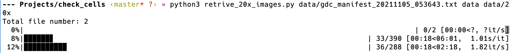

# WSI tools

Some utilities or convenient tools for histopathological whole slide images.
These images can be found from the TCGA database.

For any question please contact <zhangya998@gmail.com>.

## Prepration

1. Install required python packages:

```
python3 -m pip install -r requirements.txt
```

2. Install openslide library:
   1. MacOS/Linux: see [Openslide Install Guide](https://openslide.org/download/)
   ```
   brew install openslide (MacOS)
   apt-get install openslide-tools (Debian/Ubuntu)
   ```
   2. Windows:
        1. Download binary zip from [https://openslide.org/download/](https://openslide.org/download/).
        2. Copy files from `bin` to `C:\Windows\System32`.


## retrive\_20x\_images.py

Crop whole slide histopathological images(WSI, svs) to patch.
All patches will have 20x magnification. WSIs with 40x magnification are downsa-
mpled to 20x, and WSIs with 5x magnification are discard.
Patches that are blank or without enough pathological tissue are filtered.

This script use multi-thread to accerate process, with nice progress bar.

Usage:
    retrive_20x_images <gdc_manifest_txt_file> <gdc_download_folder> <output_folder>

    1. gdc_manifest_txt_file
       get from TCGA gdc data portal, the same file for the TCGA official downloader gdc-client.
    2. gdc_download_folder
       the folder where gdc-client download all files
    3. output_folder
       The destination for selected patches.

### Screenshots


